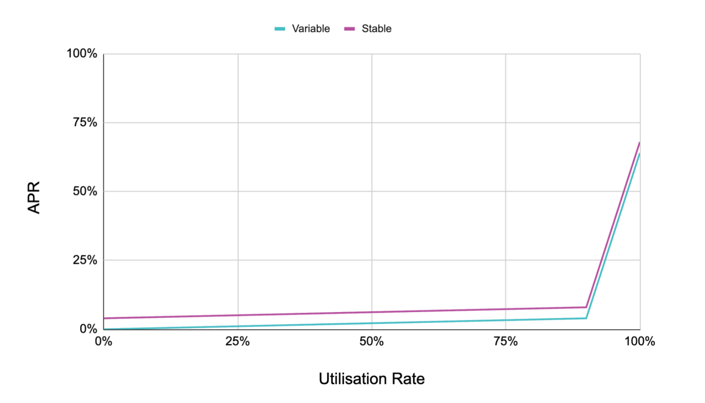

# Proton Lending
# Documentation

Most principles and terminology of [Compound Finance](https://compound.finance/docs) apply here as well.

## Overview

The lending protocol is a P2P protocol consisting of two parties:

- **Lenders** who supply tokens to a market
- **Borrowers** borrow the supplied tokens from a market and pay interest to the lenders in return

As one does not know the parties who engage as borrowers it's impossible to assess a borrower's default risk and all loans are required to be **over-collateralized**.
To borrow B\$, a borrower has to put up C\$ as collateral where `collateral_factor * C >= B` needs to hold. The **collateral factor** is a percentage value specific to the borrowing market. (Common values are ~70%.)
Generally, the collateral factor is lower for volatile markets and higher for more stable markets.

### Liquidations

In case the borrower's borrowed assets fall below the max. borrow threshold of `collateral_factor * C`, the borrower is considered to be _illiquid_ and can be _liquidated_:
Anyone can be a liquidator and liquidate a user by repaying this user's debt and seizing the user's collateral in return. Liquidators are important for the system's health and are therefore incentivized to perform liquidations by receiving a _discount_ on the seized collateral, i.e., they receive more collateral than the debt they repaid for the borrower.  
The collateral factor also serves as a buffer for liquidations and ensures that a borrower becomes liquid again after liquidations occurred.
A collateral factor of 100% would result in a borrower being completely liquidated and losing all their collateral as soon as they drop below their borrow threshold.

### Borrow rates & types

Borrow rates depend on the **utilization rate** of the market which is the ratio of currently borrowed assets to total available assets for borrowing.
Being a P2P protocol, each borrowed token must have been supplied by a lender which could result in all tokens currently being borrowed and lenders being unable to withdraw their supplied tokens at the moment. To solve this, markets have an _optimal utilization rate_ that is targeted for each market, usually about 80%.

To drive the market towards this utilization rate, borrow rates are low if below the target to incentivize borrowers to take out loans and provide more attractive returns for lenders. If the current utilization rate is above the target, borrow rates drastically spike to disincentive taking out new loans (or incentivize repaying loans) such that there is always enough liquidity for lenders to withdraw their tokens again.

The interest model consists of two linear functions merged at the optimal utilisation rate. The slopes, optimal utilisation rate, and base rate parameters can be configured for each market.



> [Aave/Compound's interest model](https://docs.aave.com/risk/liquidity-risk/borrow-interest-rate)

The Proton lending protocol provides two types of loans:

- **Variable Loans**: The borrowing rate depends on the current utilization rate and therefore fluctuates over time. Note that all borrowers of the same market also pay the same borrow rates on all of their loans.
- **Stable Loans**: The protocol also offers _fixed-rate_ stable loans. These loans have a higher borrow rate than variable borrows but the rate is locked in and the borrowing rate does not fluctuate over time.
  > Note that under special circumstances of lenders not earning enough interest, even the stable loan rates can be rebalanced.

## Tables

<details>
  <summary>Show Tables</summary>

### TABLE `markets`

- `{extended_symbol} share_symbol`: the interest-bearing token (f.i., LUSDC) that can be exchanged for the underlying. Its symbol code defines the market name. It is a user's share on totalCash + totalBorrows - totalReserves and acts like an LP token
- `{extended_symbol} underlying_symbol`: the actual token being borrowed / debt accrues on (f.i., USDC)
- `{interest_rate_model} variable_interest_model`: the interest (borrow rate) model for variable borrows
- `{interest_rate_model} stable_interest_model`: the interest (borrow rate) model for fixed rate stable borrows
- `{double} collateral_factor`: percentage on a user's total collateral value. user can borrow up _collateral_factor \* collateral_value_ in this market. it's recommended to borrow less than this, otherwise, users will get liquidated immediately
- `{double} reserve_factor`: percentage on debt accruals (interest) that go to the reserve
- `{double} borrow_index`: index on the total variable borrows indicating the variable borrows principal + debt accrued. Required to keep track of each user's borrow state without having to accrue debt on each user on each borrow
- `{double} average_stable_rate`: average stable rate among all stable borrowers at last_stable_update
- `{bool} stable_loans_enabled`: indicates whether fixed-rate stable loans are enabled in this market
- `{double} max_stable_borrow_percentage`: max available loan size for a _single_ stable loan as a percentage of available liquidity
- `{time_point} variable_accrual_time`: last time variable debt was accrued
- `{time_point} stable_accrual_time`: last time stable debt was accrued
- `{extended_asset} total_variable_borrows`: the total variable borrows (+ interest) at the time of last borrow_index update
- `{extended_asset} total_stable_borrows`: the total stable borrows (+ interest) at the time of last stable_accrual_time
- `{extended_asset} total_reserves`: total reserves
- `{uint64_t} oracle_feed_index`: oracle feed index for _common base unit_ per underlying

### TABLE `shares`

- `{name} account`: user account for this share position
- `{map<extended_symbol, int64_t>} tokens`: maps share symbol to the balance

### example

```json
{
  "account": "liquidator11",
  "tokens": [
    {
      "key": { "sym": "8,LBTC", "contract": "lendingtoks" },
      "value": 92812191
    }
  ]
}
```

### TABLE `borrows`

- `{name} account`: user account for this borrow position
- `{map<extended_symbol, borrow_snapshot>} tokens`: maps underlying symbol to the borrow snapshot
- `{int64_t} borrow_snapshot.variable_principal`: variable debt principal in the sense of present value at time of last `interest_index` update. (not initial user borrow amount)
- `{int64_t} borrow_snapshot.stable_principal`: stable debt principal in the sense of present value at time of `last_stable_update`
- `{time_point} borrow_snapshot.last_stable_update`: last time the stable debt position was updated (borrowed or debt accrued)
- `{double} borrow_snapshot.stable_rate`: current stable rate the user pays on `stable_principal`

### example

```json
{
  "account": "liquidator11",
  "tokens": [
    {
      "key": { "sym": "8,BTC", "contract": "lendingtoku" },
      "value": {
        "variable_principal": 128349145,
        "variable_interest_index": "1.00247716825649213",
        "stable_principal": 0,
        "last_stable_update": "2021-04-14T11:45:28.500",
        "stable_rate": "0.00000000000000000"
      }
    }
  ]
}
```

### TABLE `globals.cfg`

- `{name} oracle_contract`: the account name of the oracle contract
- `{double} close_factor`: percentage multiplier used to calculate the maximum repayAmount when liquidating an under-water borrow
- `{double} liquidation_incentive`: multiplier representing the discount on collateral a liquidator receives
- `{extended_symbol} reward_symbol`: the extended symbol of the token rewards are paid in

### example

```json
{
  "oracle_contract": "lendingoracl",
  "close_factor": "0.10000000000000001",
  "liquidation_incentive": "0.10000000000000001",
  "reward_symbol": { "sym": "4,REWARDS", "contract": "lendingtoku" }
}
```

### TABLE `rewards.cfg`

- `{symbol_code} market_symbol`: references share symbol of the market these rewards are for
- `{int64_t} supplier_rewards_per_half_second`: amount of reward tokens to distribute to this market's suppliers per block
- `{int64_t} borrower_rewards_per_half_second`: index result of the last borrower rewards allocation
- `{double} borrow_index`: index result of the last borrower rewards allocation
- `{time_point} borrow_time`: last time at which rewards for borrowers were allocated
- `{double} supply_index`: index result of the last supplier rewards allocation
- `{time_point} supply_time`: last time at which rewards for suppliers were allocated

### example

```json
{
  "market_symbol": "LBTC",
  "supplier_rewards_per_half_second": 10000,
  "borrower_rewards_per_half_second": 5000,
  "borrow_index": "113.71991308023906697",
  "borrow_time": "2021-04-14T11:46:21.000",
  "supply_index": "181.44347456197505153",
  "supply_time": "2021-04-14T11:46:21.000"
}
```

### TABLE `rewards`

- `{name} account`: user account for this reward position
- `{map<symbol_code, reward_snapshot>} markets`: maps share (market) symbol to the reward snapshot
- `{int64_t} reward_snapshot.accrued_amount`: rewards accrued but not claimed yet
- `{double} reward_snapshot.borrower_index`: last index of when rewards for borrowing were updated
- `{double} reward_snapshot.supplier_index`: last index of when rewards for supplying were updated

### example

```json
{
  "account": "liquidator11",
  "markets": [
    {
      "key": "LBTC",
      "value": {
        "accrued_amount": "13093232280",
        "borrower_index": "113.71582267527729471",
        "supplier_index": "181.43498378833675133"
      }
    }
  ]
}
```

</details>

## Actions

<details>
  <summary>Show User Actions</summary>

### DEPOSIT SHARES (COLLATERAL)

Deposits share tokens which increases the collateral value.

This action is triggered as a `transfer` action of the share symbol contract.

- **authority**: `from`
- **requirements**: none
- **memo**: `deposit`

#### example

```json
{
  "account": "share",
  "name": "transfer",
  "data": {
    "from": "user",
    "to": "lending",
    "quantity": "1.00000000 LBTC",
    "memo": "deposit"
  }
}
```

### WITHDRAW SHARES

Withdraw share tokens which decreases the collateral value.

- **authority**: `withdrawer`
- **requirements**: the total collateral value after the transaction needs to cover the user's debt. The user needs to have enough share tokens deposited.

#### args

- `{name} withdrawer`: the withdrawing user
- `{extended_asset} token`: the share token amount to withdraw

#### example

```json
{
  "account": "lending",
  "name": "withdraw",
  "data": {
    "withdrawer": "user",
    "token": {
      "quantity": "1.00000000 LBTC",
      "contract": "share"
    }
  }
}
```

### MINT SHARES

Transfers `underlying` tokens to the contract and mints an equivalent amount in `share` tokens according to the current exchange rate.
The increase in share tokens is minted to the lending contract and the minter's share balance is increased.

This action is triggered as a `transfer` action of the underlying symbol contract.

- **authority**: `from`
- **requirements**: none
- **memo**: `mint`

#### example

```json
{
  "account": "underlying",
  "name": "transfer",
  "data": {
    "from": "user",
    "to": "lending",
    "quantity": "1.00000000 BTC",
    "memo": "mint"
  }
}
```

### REDEEM SHARES

Burn deposited `share` tokens and receive an equivalent amount in `underlying` tokens according to the current exchange rate.

- **authority**: `redeemer`
- **requirements**: the total collateral value after the transaction needs to cover the user's debt. The market needs to have enough underlying tokens available (`cash`) for the withdrawal, check the utilisation ratio. The user needs to have enough share tokens deposited.

#### args

- `{name} redeemer`: the redeeming user
- `{extended_asset} token`: the (already deposited) share token amount to redeem for underlying

#### example

```json
{
  "account": "lending",
  "name": "redeem",
  "data": {
    "redeemer": "user",
    "token": {
      "quantity": "1.00000000 LBTC",
      "contract": "share"
    }
  }
}
```

### BORROW UNDERLYING

Take out a loan of the underlying token of a market.

- **authority**: `borrower`
- **requirements**: the total collateral value after the transaction needs to cover the user's debt. The market needs to have enough underlying tokens available (`cash`) for the borrow, check the utilisation ratio. Stable loans need to be enabled in the market when borrowing using stable loans.

#### args

- `{name} borrower`: the borrowing user
- `{extended_asset} underlying`: the amount of underlying tokens to borrow
- `{bool} use_stable_rate`: true when using fixed-rate stable loans or not, false for variable rate loans.

#### example

```json
{
  "account": "share",
  "name": "borrow",
  "data": {
    "borrower": "user",
    "underlying": {
      "quantity": "1.00000000 BTC",
      "contract": "underlying"
    },
    "use_stable_rate": true
  }
}
```

### REPAY BORROWS

Transfers `underlying` tokens to the contract and pays off a user's debt.
When repaying more than the debt, the excess amount is returned to the payer.
Allows repaying the debt of a different borrower.

This action is triggered as a `transfer` action of the underlying symbol contract.

- **authority**: `from=payer`
- **requirements**: none
- **memo**: `repay,(variable|stable)[,borrower]`. Use `variable` to repay the variable borrows, `stable` to repay the stable borrows. Optionally, set the `borrower` for whom to pay off the debt - if not set, the borrower is the payer.

#### example

```json
{
  "account": "underlying",
  "name": "transfer",
  "data": {
    "from": "payer",
    "to": "lending",
    "quantity": "1.00000000 BTC",
    "memo": "repay,variable"
  }
}
```

### DEPOSIT RESERVE

Transfers `underlying` tokens to the contract and increases the market's reserve.

This action is triggered as a `transfer` action of the underlying symbol contract.

- **authority**: `from`
- **requirements**: none
- **memo**: `repay,(variable|stable)[,borrower]`. Use `variable` to repay the variable borrows, `stable` to repay the stable borrows. Optionally, set the `borrower` for whom to pay off the debt - if not set, the borrower is the payer.

#### example

```json
{
  "account": "underlying",
  "name": "transfer",
  "data": {
    "from": "user",
    "to": "lending",
    "quantity": "1.00000000 BTC",
    "memo": "reserve"
  }
}
```

### WITHDRAW RESERVE

Take out a loan of the underlying token of a market.

- **authority**: `self`
- **requirements**: the amount to withdraw must not be higher than the current amount accumulated for the reserve

#### args

- `{name} to`: the account that will receive the withdrawal
- `{extended_asset} underlying`: the amount of underlying reserve tokens to withdraw

#### example

```json
{
  "account": "lending",
  "name": "withdraw.res",
  "data": {
    "to": "governance",
    "underlying": {
      "quantity": "1.00000000 BTC",
      "contract": "underlying"
    }
  }
}
```

### LIQUIDATE

Transfers `underlying` tokens to the contract and pays off an illiquid user's borrows.
A discounted amount of collateral tokens are transferred from the user to the liquidator.
Liquidation can be seens as a `repay` action followed by a seizing of collateral.

This action is triggered as a `transfer` action of the underlying symbol contract.

- **authority**: `from=liquidator`
- **requirements**: the liquidatee must be illiquid (the total collateral value does not cover the user's debt). the amount to be repaid must be less than `globals.close_factor`. the liquidatee must have an equivalent amount of discounted share tokens as the repaid debt value.
- **memo**: `liquidate,borrower,LBTC`. Specify the borrower to liquidate and the market to seize the borrower's collateral in.

#### example

```json
{
  "account": "underlying",
  "name": "transfer",
  "data": {
    "from": "liquidator",
    "to": "lending",
    "quantity": "1000.0000 USDC",
    "memo": "liquidate,borrower,LBTC"
  }
}
```

### REBALANCE STABLE LOAN

Changes a user's stable loan borrow rate to the stable loan rate at current utilization.

- **authority**: `self`
- **requirements**: 1. utilization ratio is above a threshold (~90%) and 2. the current average borrow rate is below `REBALANCE_UP_THRESHOLD` of `maxVariableBorrowRate`, which means that too much has been borrowed at low stable rates and depositors are not earning enough interest

#### args

- `{name} borrower`: the stable loan borrower to rebalance
- `{symbol_code} market_symbol`: the market of the stable loan to rebalance

#### example

```json
{
  "account": "lending",
  "name": "rebalstable",
  "data": {
    "borrower": "user",
    "market_symbol": "LBTC"
  }
}
```

### CLAIM REWARDS

Claims any out-standing rewards for the markets (`rewards.markets[market].accrued_amount`).
The rewards are not updated before claiming, this action should be combined with the `update.user` action to claim up-to-date rewards.

- **authority**: `user` or `self`
- **requirements**: none

#### args

- `{name} user`: The user claiming rewards
- `{vector<symbol_code> markets} markets`: the market symbols of the markets to claim rewards from

#### example

```json
{
  "account": "lending",
  "name": "claim",
  "data": {
    "user": "user",
    "markets": ["LBTC"]
  }
}
```

### UPDATE USER

Updates a user's tables by accruing debt and rewards.

- **authority**: none
- **requirements**: none

#### args

- `{name} user`: The user claiming rewards

#### example

```json
{
  "account": "lending",
  "name": "update.user",
  "data": {
    "user": "user"
  }
}
```

### ENTER MARKETS

Enters the specified markets for a user by opening relevant table entries for the market.
The user can only lend and borrow to markets they have entered.
Is a no-op if the user already entered the market.

- **authority**: `payer`
- **requirements**: none

#### args

- `{name} payer`: The account paying for any RAM increases
- `{name} user`: The user entering the markets
- `{vector<symbol_code> markets} markets`: the market symbols of the markets to enter

#### example

```json
{
  "account": "lending",
  "name": "entermarkets",
  "data": {
    "payer": "payer",
    "user": "user",
    "markets": ["LBTC"]
  }
}
```

### EXIT MARKETS

Exits the specified markets for a user by closing relevant table entries for the market.

- **authority**: `user`
- **requirements**: the user must not have any out-standing rewards, collateral, or borrows in the markets to exit.

#### args

- `{name} user`: The user exiting the markets
- `{vector<symbol_code> markets} markets`: the market symbols of the markets to exit

#### example

```json
{
  "account": "lending",
  "name": "exitmarkets",
  "data": {
    "user": "user",
    "markets": ["LBTC"]
  }
}
```

</details>

<details>
  <summary>Show Admin Actions</summary>

### CREATE MARKET

Creates a new market.

- **authority**: `self`
- **requirements**: The share token must already exist and its issuer must be the lending contract. The underlying token must already exist. No other market using either the underlying symbol or the share symbol may already exist.

#### args

- `{extended_symbol} share_symbol`: The interest-breaing share token
- `{extended_symbol} underlying_symbol`: The underlying token of the market that can be lent and borrowed.
- `{interest_rate_model} variable_interest_model`: the variable interest model to use
- `{optional<interest_rate_model>} stable_interest_model`: the stable interest model to use. if undefined, this market starts with stable loans disabled.
- `{double} collateral_factor`: the collateral factor for the new market
- `{double} reserve_factor`: the reserve factor for the new market
- `{double} oracle_feed_index`: the base per underlying oracle feed index of the `globals.oracle_contract` contract.

#### example

```json
{
  "account": "lending",
  "name": "createmarket",
  "data": {
    "share_symbol": {
      "sym": "8,LBTC",
      "contract": "share"
    },
    "underlying_symbol": {
      "sym": "8,BTC",
      "contract": "underlying"
    },
    "variable_interest_model": {
      "base_rate_half_second": 0.0,
      "slope_half_second": 0.000000005,
      "jump_slope_half_second": 0.00000001,
      "kink": 0.8
    },
    "stable_interest_model": null,
    "collateral_factor": 0.7,
    "reserve_factor": 0.1,
    "oracle_feed_index": 0
  }
}
```

### INIT REWARDS

Initializes the reward systems by specifying the reward token that will be used for all markets.

- **authority**: `self`
- **requirements**: the reward token has not already been initialized

#### args

- `{extended_symbol} reward_symbol`: The reward token

#### example

```json
{
  "account": "lending",
  "name": "initrewards",
  "data": {
    "reward_symbol": {
      "contract": "reward",
      "sym": "4,REWARDS"
    }
  }
}
```

### SET REWARDS

Sets market rewards for a market

- **authority**: `self`
- **requirements**: none

#### args

- `{symbol_code} market`: The market to set the rewards for
- `{asset} supplier_rewards_per_half_second`: The rewards per half-second (block) that will be distributed proportionally to all share holders of this market. ⚠️ the shares must be deposited to the lending contract to be eligible for rewards
- `{asset} borrower_rewards_per_half_second`: The rewards per half-second (block) that will be distributed proportionally to all borrowers of this market

#### example

```json
{
  "account": "lending",
  "name": "setrewards",
  "data": {
    "market": "LBTC",
    "supplier_rewards_per_half_second": "0.0001 REWARDS",
    "borrower_rewards_per_half_second": "0.0000 REWARDS"
  }
}
```

### SETTER ACTIONS

There are several actions to set configuration parameters of the global lending system or on a per-market level

- **authority**: `self`
- **requirements**: none

#### example

```js
// set oracle
{
  "account": "lending",
  "name": "set.oracle",
  "data": {
    "oracle_contract": "oracle"
  }
}

// set close factor
{
  "account": "lending",
  "name": "set.closef",
  "data": {
    "multiplier": 0.05
  }
}

// set liquidation factor (incentive)
{
  "account": "lending",
  "name": "set.liqf",
  "data": {
    "multiplier": 0.05
  }
}

// market: set stable / variable interest rate
// using use_stable_rate=true and model=null disabled stable loans in the market
{
  "account": "lending",
  "name": "setm.rates",
  "data": {
      "market_symbol": "LBTC",
      "use_stable_rate": false,
      "model": {
        "base_rate_half_second": 0.000000001,
        "slope_half_second": 0.0,
        "jump_slope_half_second": 0.0,
        "kink": 1.0
      }
  }
}

// market: set collateral factor
{
  "account": "lending",
  "name": "setm.collat",
  "data": {
      "market_symbol": "LBTC",
      "collateral_factor": 0.7
  }
}

// market: set reserve factor
{
  "account": "lending",
  "name": "setm.reserve",
  "data": {
      "market_symbol": "LBTC",
      "reserve_factor": 0.1
  }
}

// market: set max stable borrow percentage factor
{
  "account": "lending",
  "name": "setm.maxstbl",
  "data": {
      "market_symbol": "LBTC",
      "max_stable_borrow_percentage": 0.20
  }
}
```

</details>
